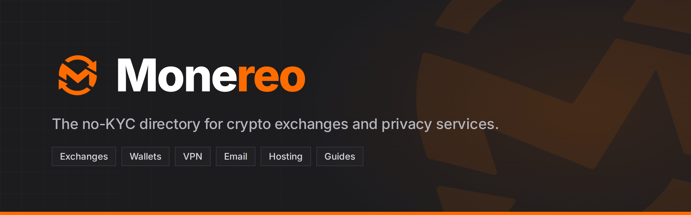
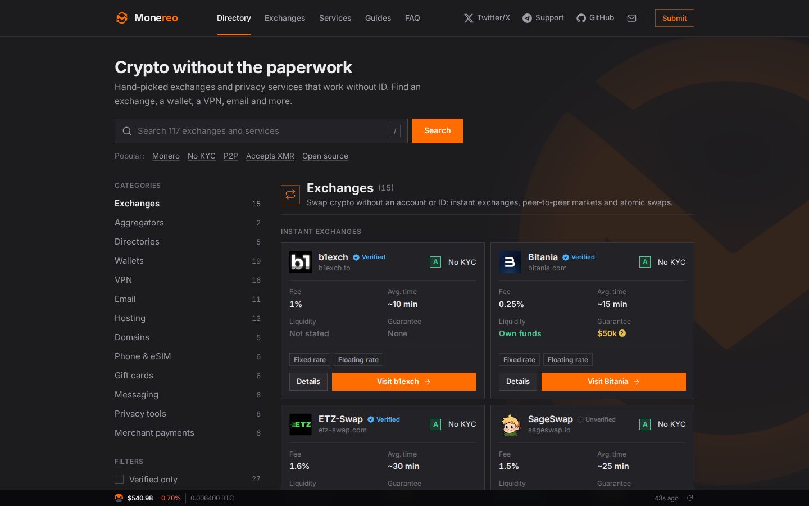

<p align="center">
  <a href="https://monereo.com"></a>
</p>

<p align="center">
  <a href="https://monereo.com"></a>
  <a href="LICENSE"></a>
  
  
  
</p>

<p align="center">
  <a href="https://monereo.com"><b>Website</b></a> &nbsp;·&nbsp;
  <a href="https://monereo.com/no-kyc-exchanges">Exchanges</a> &nbsp;·&nbsp;
  <a href="https://monereo.com/guides">Guides</a> &nbsp;·&nbsp;
  <a href="https://monereo.com/submit">Submit a service</a>
</p>

---

The source code of [monereo.com](https://monereo.com), a directory of no-KYC crypto exchanges and privacy services: VPNs, email, hosting, wallets, privacy tools and more, with plain-language guides.

| | |
| --- | --- |
| 📦 **No dependencies** | Plain Node.js, no npm packages, no build step, no database server. |
| 🕶️ **No tracking** | No cookies for visitors, no third-party scripts or fonts. Statistics are anonymous daily totals counted on the server. |
| 🧩 **Works without JavaScript** | Search, filters, the submit form and every link work with scripts disabled. |
| 🛠️ **Admin panel** | Exchanges, directory listings, categories, submissions, site settings, statistics and admin accounts. |
| 🔎 **SEO pages** | Every category, listing and guide gets its own page, with a sitemap and structured data. |

<p align="center">
  
</p>

## Run it

You need Node.js 18 or newer.

```sh
git clone https://github.com/marceltheking/Monereo.git
cd Monereo
npm start            # or: node server.mjs
```

The site runs at <http://127.0.0.1:3004>. On the first start, the server creates `data/db.json` with sample content and an admin account called `root`. **Its password is printed once in the server log.** Sign in at `/admin`; you must choose a new password straight away.

### Settings

| Variable | Default | What it does |
| --- | --- | --- |
| `PORT` | `3004` | Port to listen on. The server always binds to 127.0.0.1. |
| `DATA_DIR` | `./data` | Where the data, statistics and uploaded images are stored. |
| `SITE_URL` | `https://monereo.com` | Your public address, used in canonical links, the sitemap and social previews. |
| `ADMIN_PASSWORD` | random | First password for `root` on a fresh install, instead of a random one. |

## Deploy

The server only listens on localhost, so put a reverse proxy with HTTPS in front of it. It reads the visitor's address from the last entry of `X-Forwarded-For`, which is what Caddy and nginx append.

Example with [Caddy](https://caddyserver.com):

```
example.com {
    encode zstd gzip
    reverse_proxy 127.0.0.1:3004
}
```

Example systemd service, `/etc/systemd/system/monereo.service`:

```ini
[Unit]
Description=Monereo
After=network.target

[Service]
User=monereo
WorkingDirectory=/srv/monereo
Environment=PORT=3004
Environment=SITE_URL=https://example.com
ExecStart=/usr/bin/node server.mjs
Restart=always

[Install]
WantedBy=multi-user.target
```

## Data

Everything lives in `DATA_DIR`:

- `db.json`: listings, settings, admin accounts (scrypt password hashes), sessions, submissions and the admin activity log.
- `stats.json`: anonymous daily visitor totals.
- `uploads/`: images uploaded in the admin.

The data directory is in `.gitignore` and must never be committed or shared. Back it up instead.

The server keeps the data in memory and writes the whole file on every change. **Do not edit `db.json` while the server is running**, because the next change made in the admin overwrites your edit. Stop the server, edit, then start it again. Better still, make changes in the admin, or export and import from Site settings.

## Project layout

```
server.mjs          HTTP server and routing
src/views.mjs       Page layout, header and footer, homepage directory
src/pages.mjs       Category and listing pages
src/seo-content.mjs Category URLs, titles, intros and FAQs
src/guides.mjs      The guides
src/admin.mjs       Admin API, accounts and sessions
src/submit.mjs      "Submit a service" form
src/stats.mjs       Anonymous statistics
src/ticker.mjs      XMR price bar (fetched by the server, cached for 60 seconds)
src/seed.mjs        Sample content for a fresh install
public/             CSS, browser scripts, font and images
```

## Contributing

Issues and pull requests are welcome. To suggest a service for the directory, use the **Submit** form on the website rather than a pull request.

## License

The code is licensed under the [GNU Affero General Public License v3.0](LICENSE). If you run a modified version as a public website, you must offer its source code to your visitors.

- The Inter font in `public/inter.woff2` is licensed under the [SIL Open Font License 1.1](LICENSES/Inter-OFL-1.1.txt).
- The service logos in `public/` (`dir-*` and `ex-*` files) are trademarks of their owners. They are included only to identify the listed services and are not covered by this project's license.
- The Monereo name and logo identify the monereo.com website. If you run your own copy, please use your own name and logo.
